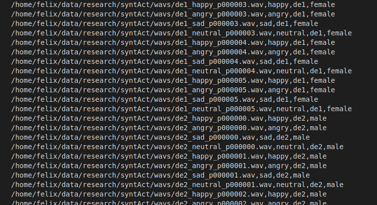

# syntAct
Scripts to generate a database of simulated emotional vocal expression.


These scripts synthesize a database of simulated emotional expression.

NEW! we added scripts to do this with SSML tags to support the paper

*Going Retro: Astonishingly Simple Yet Effective Rule-based Prosody Modelling for Speech Synthesis Simulating Emotion Dimensions*

[Go here to get started on SSML](ssml)


Out-of-the box it only works in German, but potentially in all languages supported by Mbrola (34 languages)

You need in addition:

* a text corpus 
* the [emofilt software](http://emofilt.syntheticspeech.de/)
* the [MARY tts software version 4.3.1](http://mary.dfki.de/download/index.html#mary-tts-4x) (version 5 is without Mbrola support)
* the [MBROLA software](https://github.com/numediart/MBROLA)

A [paper](http://felix.syntheticspeech.de/publications/synthetic_database.pdf) on syntAct got accepted at the [Dataset Creation for Lower-Resourced Languages](https://dclrl.github.io/) workshop in conjunctin with LREC 2022.

## Contents
### scripts
Scripts to generate the database and convert to audformat in Python.
* **constant.py**: constant values
* **make_audformat_db.py**: generate a database that loads with audb/audformat
* **make_wavs_categories.py**: generate a set of wav files and a database list for emotional categories (to be stated in constant.py) 
* **make_wavs_dimensions.py**: generate a set of wav files and a database list for emotional dimensions (to be stated in constant.py) 
* **say_emo.py**: sccript to generate a single wav file
* **shared.py**: helper functions shared by the mains scripts

## Installation

* install emofilt (to emotionalize the output)
* install MARY 4.x (for German NLP)
* install mbrola (for diphone DSP)
* install the German voices de1, de2, de3, de4, de6, de7
* (install other voices if you have a NLP for the language)
* install python version >= 3.6
* install and activate a python virtual environment
* install required packages
* adjust paths in scripts/constant.py

## Usage

* This has been tried ONLY on Ubuntu 20 (but should run with any linux)
* try as first test the script say_emo.py:
* REQUIRES the Mary4.x server to be started!
```
python scripts/say_emo.py --text "Das ist mal ein kurzer Testsatz in trauriger Sprechweise." --emo sad --voc de6 --wav test.wav --play
```

* Next, you might try to generate a whole set of wave files for categories:
```
python scripts/make_wavs_categories.py --texts demo/texts.txt --num 20
```
    The generated audio files should appear in a newly created folder called *synthesized_audio* and the file list in a file called *synth_out.csv*  

* Then you might try to generate a set of wave files with simulated arousal and valence dimension
```
python scripts/make_wavs_dimensions.py --texts --texts demo/texts.txt --num 5
```
* Finally, you might try to make an [audformat](https://audeering.github.io/audformat/index.html) database with
```
python scripts/make_audformat_db.py
```
* Careful, not all voice files result in 16kHz sampling rate, some are 22kHz. You might want to unify this with
```
for f in `ls synthesized_audio`; do `sox synthesized_audio/$f -r 16000 tmp/$f`; done
```


* If you like, you can try your new database with [nkululeko](https://github.com/felixbur/nkululeko/)
* Here's a suggestions for an .ini file:
```
[EXP]
root = ./tests/
name = exp_syntact
runs = 1
epochs = 1
save = True
[DATA]
databases = ['syntact']
syntact = /home/felix/data/research/syntAct/syntact/
syntact.split_strategy = speaker_split
syntact.testsplit = 50
syntact.value_counts = True
target = emotion
labels = ['angry', 'happy', 'neutral', 'sad']
[FEATS]
#type = trill
type = os
scale = standard
[MODEL]
type = svm
save = True
[PLOT]
value_counts = True
tsne = True
```

## Screenshot

